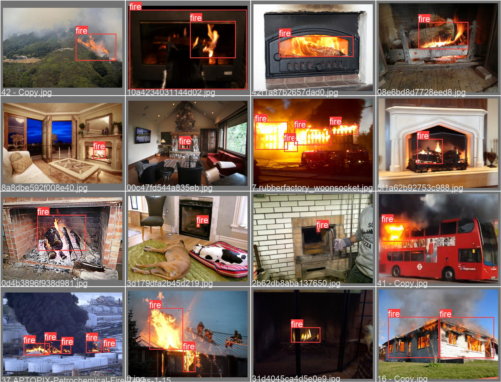
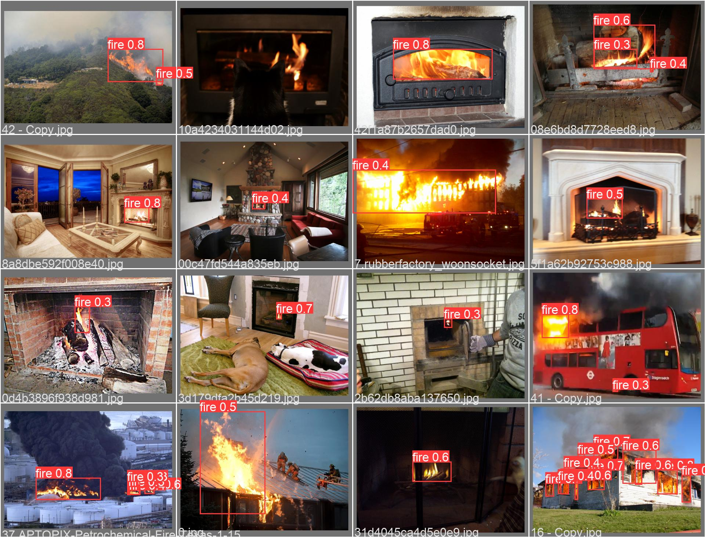

# Yolov5 for Fire Detection

## Dataset
https://mega.nz/file/MgVhQSoS#kOcuJFezOwU_9F46GZ1KJnX1STNny-tlD5oaJ9Hv0gY
## Train
```
python train.py --img 640 --batch 16 --epochs 3 --data coco128.yaml --weights yolov5s.pt --workers 1
```
## Inference
```
python detect.py --source E:/Research/Project2/fire/input/14.mp4 --weights E:\Programs\yolov5\runs\train\exp10\weights\best.pt
```

# Result





## Reference

* https://github.com/robmarkcole/fire-detection-from-images
* https://github.com/ultralytics/yolov5
